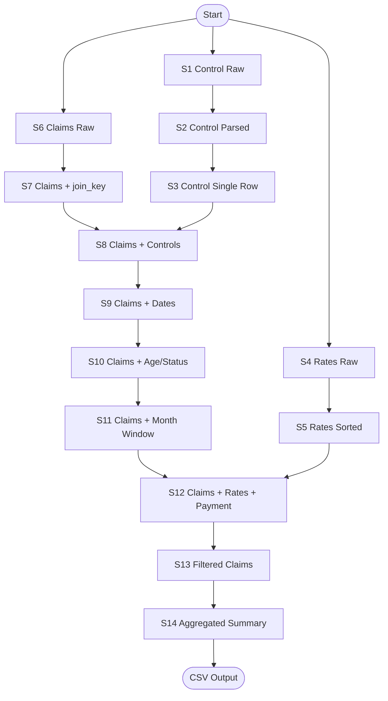

Below is a **fully descriptive, implementation-ready specification** of your SPSS/PSPP pipeline.

I’ve chosen a **structured, declarative “Data Pipeline Specification” format** that is:

* Human readable
* Deterministic
* Language-agnostic
* Directly mappable to SQL / R / Python / Spark / etc.
* Explicit about types, joins, filters, and calculations
* Suitable as a first version of an intermediate representation (IR)

You could later serialize this to YAML/JSON, but here I keep it readable.

---

# Data Pipeline Specification

**Encoding:** UTF-8
**Purpose:** Monthly benefit expenditure – Official Statistics Production
**System compatibility:** PSPP / SPSS semantics

---

## 1. Global conventions

### 1.1 Missing values

* `$SYSMIS` represents numeric missing.
* String missing = empty or undefined string.

### 1.2 Date representation

* SPSS internal dates are **seconds since 1582-10-14** (Gregorian origin).
* All date arithmetic operates in **seconds**.
* Conversion factors:

  * 1 day = 86400 seconds
  * 1 year = 365.25 days (used for age)

### 1.3 String handling

* All string comparisons using:

  * `RTRIM(string)` → remove trailing whitespace
  * Case-sensitive

---

## 2. Input datasets

### 2.1 `control_vars.csv`

| Column    | Type   | Width | Description             |
| --------- | ------ | ----- | ----------------------- |
| parameter | string | 20    | Control parameter name  |
| value     | string | 20    | Control parameter value |

* CSV
* Header row present
* First data row = line 2

---

### 2.2 `benefit_rates.csv`

| Column       | Type    | Description         |
| ------------ | ------- | ------------------- |
| benefit_type | string  | Benefit code        |
| weekly_rate  | decimal | Weekly payment rate |

---

### 2.3 `claims_data.csv`

| Column       | Type    | Description                  |
| ------------ | ------- | ---------------------------- |
| claim_id     | integer | Claim identifier             |
| person_id    | integer | Person identifier            |
| dob          | string  | Date of birth in YYYYMMDD    |
| claim_start  | string  | Claim start date in YYYYMMDD |
| claim_end    | string  | Claim end date in YYYYMMDD   |
| benefit_type | string  | Benefit code                 |
| region       | string  | Region                       |
| status       | string  | Claim status                 |

---

## 3. Control variable extraction stage

### 3.1 Initialize control storage

Create variables:

| Variable          | Type   | Initial value |
| ----------------- | ------ | ------------- |
| min_age_n         | number | missing       |
| max_age_n         | number | missing       |
| reference_month_n | number | missing       |
| exclude_status_s  | string | empty         |

---

### 3.2 Row-wise parameter parsing

For each row in `control_vars.csv`:

| Condition                              | Action                                                |
| -------------------------------------- | ----------------------------------------------------- |
| RTRIM(parameter) = `"MIN_AGE"`         | min_age_n = parse integer(value, format F3.0)         |
| RTRIM(parameter) = `"MAX_AGE"`         | max_age_n = parse integer(value, format F3.0)         |
| RTRIM(parameter) = `"REFERENCE_MONTH"` | reference_month_n = parse integer(value, format F6.0) |
| RTRIM(parameter) = `"EXCLUDE_STATUS"`  | exclude_status_s = value                              |

---

### 3.3 Collapse to single control row

Filter:

```
Keep only rows where min_age_n is not missing
```

Then:

```
Add join_key = 1
```

Result dataset:

**control_values**

| Column            |
| ----------------- |
| min_age_n         |
| max_age_n         |
| reference_month_n |
| exclude_status_s  |
| join_key (=1)     |

Saved as: `control_values.sav`

---

## 4. Benefit rate preparation stage

Load `benefit_rates.csv`.

Sort by:

```
benefit_type ascending
```

Save as:

```
benefit_rates.sav
```

---

## 5. Claims ingestion stage

Load `claims_data.csv`.

Add:

```
join_key = 1
```

---

## 6. Join control variables into claims

Left join:

```
claims_data ⋈ control_values
ON join_key
```

Result: every claim row receives the same control variables.

---

## 7. Date parsing stage

### 7.1 Numeric conversion

| New variable    | Formula                  |
| --------------- | ------------------------ |
| dob_num         | parse(dob, F8.0)         |
| claim_start_num | parse(claim_start, F8.0) |
| claim_end_num   | parse(claim_end, F8.0)   |

---

### 7.2 Date construction

Using components:

```
year  = TRUNC(num / 10000)
month = TRUNC(MOD(num,10000) / 100)
day   = MOD(num,100)
```

Construct SPSS date:

```
DATE.MDY(month, day, year)
```

Variables:

| Variable         |
| ---------------- |
| dob_date         |
| claim_start_date |
| claim_end_date   |

---

## 8. Age calculation

```
age_years =
  TRUNC( (claim_start_date - dob_date)
         / (365.25 * 86400) )
```

---

## 9. Eligibility flags

### 9.1 Age eligibility

Initialize:

```
age_valid = 1
```

Rules:

```
If age_years < min_age_n → age_valid = 0
If age_years > max_age_n → age_valid = 0
```

---

### 9.2 Status eligibility

Initialize:

```
status_valid = 1
```

Rule:

```
If RTRIM(status) = RTRIM(exclude_status_s)
  → status_valid = 0
```

---

## 10. Reference month boundaries

From:

```
reference_month_n = YYYYMM
```

Compute:

| Variable  | Formula                        |
| --------- | ------------------------------ |
| ref_year  | TRUNC(reference_month_n / 100) |
| ref_month | MOD(reference_month_n, 100)    |

Then:

```
month_start = DATE.MDY(ref_month, 1, ref_year)
month_end   = DATE.MDY(ref_month + 1, 1, ref_year) - 1 day
```

(Internally subtract 86400 seconds)

---

## 11. Eligible period intersection

```
eligible_start = MAX(claim_start_date, month_start)
eligible_end   = MIN(claim_end_date, month_end)
```

```
eligible_days = (eligible_end - eligible_start) / 86400 + 1
```

If:

```
eligible_days < 0 → eligible_days = 0
```

---

## 12. Join benefit rates

Sort claims by:

```
benefit_type
```

Join:

```
claims ⋈ benefit_rates
ON benefit_type
```

---

## 13. Payment calculation

```
daily_rate = weekly_rate / 7
payment_amount = eligible_days * daily_rate
```

---

## 14. Final filtering

Keep rows where:

```
age_valid = 1
AND status_valid = 1
AND eligible_days > 0
```

---

## 15. Aggregation

Group by:

```
benefit_type, region
```

Aggregate:

```
total_paid = SUM(payment_amount)
```

---

## 16. Output

Write CSV:

```
benefit_monthly_summary.csv
```

Properties:

* UTF-8
* Header row included
* Overwrite if exists

Columns:

| Column       |
| ------------ |
| benefit_type |
| region       |
| total_paid   |

---

## 17. Deterministic behavior guarantees

* All joins are deterministic:

  * control_values is 1 row
  * benefit_rates has unique benefit_type
* All date calculations use SPSS second-based time model
* String comparisons are trimmed but case-sensitive
* Aggregation is exact sum of computed floating values

---

## 18. Suggested machine-readable future form

For your engine, this spec maps cleanly to:

* **Relational algebra**
* or a **DAG of transformations**
* or a JSON/YAML IR such as:

```
Dataset
 → Map
 → Filter
 → Join
 → Compute
 → Filter
 → GroupBy+Aggregate
 → Output
```

Each step above already defines:

* Inputs
* Outputs
* Types
* Formulas
* Join keys
* Filters
* Units

---

If you’d like, I can next:

* Convert this spec into **formal YAML IR**
* Or into a **typed Python dataclass schema**
* Or into a **SQL-equivalent plan**
* Or design a minimal **SPSS-IR grammar** for your migration engine.

This pipeline is a very good “realistic complexity” test case 👍

